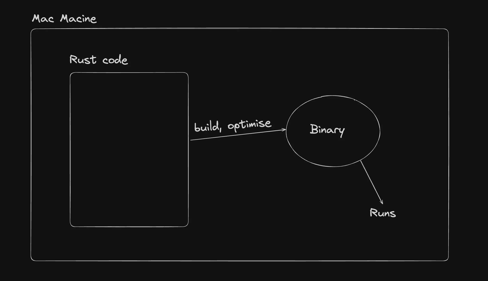
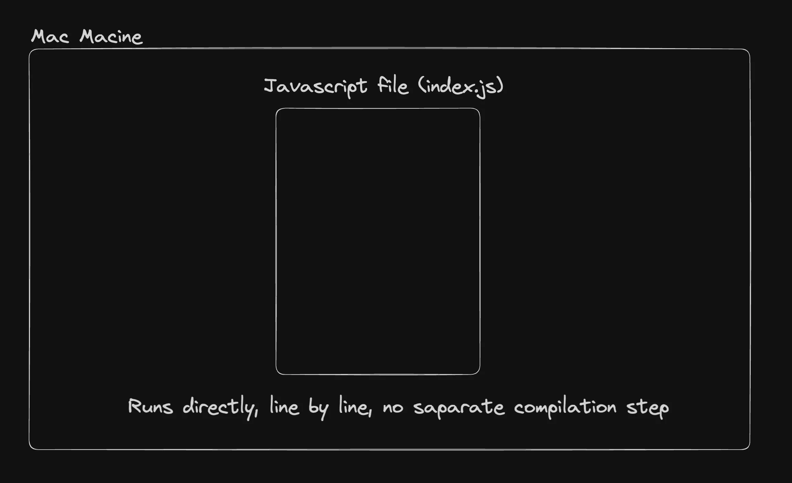

# Preface :-

Phrase 1:- In rust, if your code compiles then your code really works.
Phrase 2:- You can't segfault if you don't have null. Segfault means accessing the memory location in your device and for your code.
Phrase 3:- Rust does not hide complexity from us but it offers right tool to manage all the complexity.

Q. Why rust isn't nodejs enough?
Ans. 1. Typesafety , 
2. System language (It is intended to be used but not restricted to do lower level things) => building a compiler, building a browser, working closer to the kernel/os.
3. Generally faster.(Rust has a seprate compilation steps like c++ that spits out as an optimised binary and does a lot of static analysis at compile time.)

JS does JIT compilation. 

# Concurrency :-
Rust has built-in support for concurrent programming allowing multiple threads to perform tasks simultaneously without risking data races
Javascript is single threaded generally (there are some projects that tried making it multi threaded but rarely used)

# Memory Safe :-
Rust has a concept of owners, borrowing and lifetimes that make it extremely memory safe

Initialising rust locally ->
Rust projects can be used to do a lot of things :-
1. Create a backend for a full stack application.
2. Create CLI's.
3. Create browsers.
4. Great code editor.

# Variables in Rust ->
1. Rust give you so many differnent types of data types and each of them their own pros .
- for integer there are i8,i16,i32,i64,i124 they are for the integer number which can be negative and postivie 
- for unsigned integer there are the types of integer which only represents positive integer value there range is just as same as integer u8,u16,u32,u64,u128
- for float there are only two types f32,f64 cause the float values does not vary from their range.

*  NOTE = if you want to reduce your memory foot print always usse the i8,i16.

# Booleans:-
Have two value true or false

# Strings :-
String in rust is the most compilcated data type , the problem with strings is that they do not have the fixed size like arrays and vectors , when you have something that changes it size while the run time it becomes slightly tricky to deal with.
Strings are actually stored in the heap and there are stored as byte after byte and you can use them by using iterators.
Q. What are the three primitve types in rust ?
Ans. 1. String slower , harder to keep in memory and passing the refernce
     2. Number(integer && float) -> easy to initialse, faster
     3. Boolean(true and false) -> easy , faster

# Conditional loops and functions :-

conditional means how you can do if and else